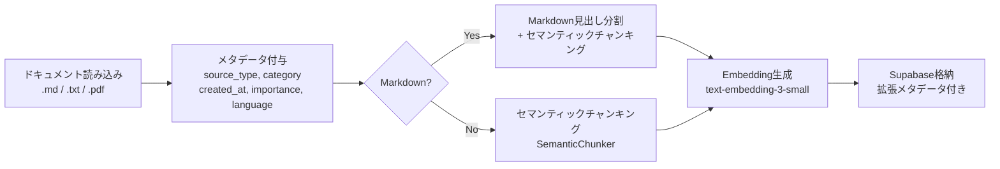
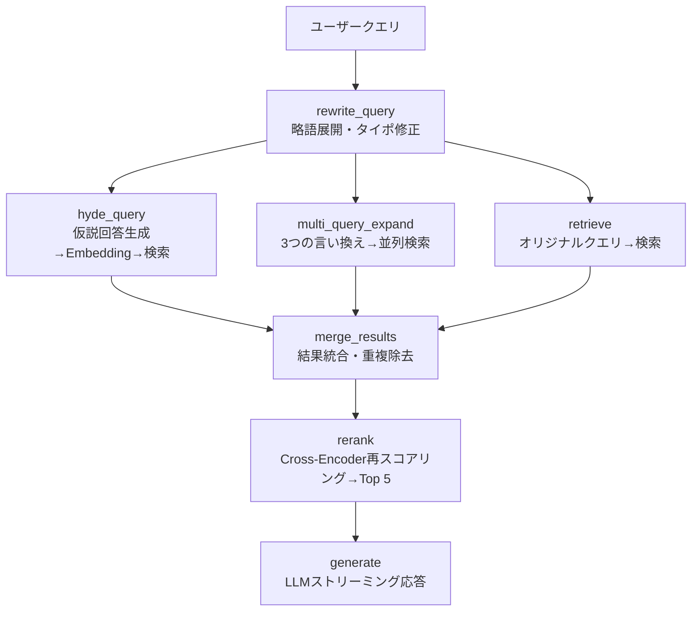

# RAG Small アーキテクチャ解説（Lv.4 刷新版）

Embedding からハイブリッド検索、HyDE + Multi-Query 並列検索、Cross-Encoder Reranking、LangGraph パイプラインによるストリーミング応答まで、ユーザーのリクエストをどのように処理しているかを `lib/` のコードを用いて説明します。

処理は大きく **2段階**（事前準備 + リアルタイム応答）に分かれます。

---

## 段階1: 事前準備（Embedding パイプライン）

ユーザーがチャットする**前に**、ナレッジ文書をベクトル化して DB に格納しておく処理です。`embedding_pipeline.py` が担当します。



### Step 1: ドキュメント読み込み + メタデータ付与

**ファイル:** `lib/embedding_pipeline.py` `load_documents()`, `_build_metadata()`

各ファイルを `Document(page_content=テキスト, metadata={...})` に変換します。メタデータには以下の項目が自動付与されます:

| メタデータ | 内容 | 例 |
|-----------|------|-----|
| `source` | ファイル名 | `test.md` |
| `type` | 拡張子 | `md` |
| `source_type` | ドキュメント種別 | `manual`, `method`, `crm_data` |
| `created_at` | ファイル更新日時（ISO 8601） | `2026-04-14T10:00:00+00:00` |
| `category` | ナレッジカテゴリ | `general`, `営業手法` |
| `importance` | 重要度 | `high`, `medium`, `low` |
| `language` | 言語 | `ja`, `en` |

CLIから `--source-type method --category 営業手法` のように上書き指定も可能です。

### Step 2: チャンク分割（固定長 / セマンティック 切り替え可能）

**ファイル:** `lib/embedding_pipeline.py` `chunk_documents()`

2つのチャンキング戦略を `--semantic` フラグで切り替えられます。

#### 固定長チャンキング（従来方式）

```python
RecursiveCharacterTextSplitter(
    chunk_size=500, chunk_overlap=100,
    separators=["\n\n", "\n", "。", ".", " ", ""],
)
```

#### セマンティックチャンキング（Lv.4 新規）

```python
SemanticChunker(
    embeddings,
    breakpoint_threshold_type="percentile",
    breakpoint_threshold_amount=95,  # 上位5%の類似度低下箇所で分割
)
```

文間のEmbedding類似度を計算し、類似度が大きく低下する箇所（上位5%）で分割します。内容の一貫性が保たれたチャンクが生成されます。

Markdown の場合は見出し分割後にセマンティックチャンキングを適用する2段階方式です。

### Step 3: Embedding 生成 + Supabase 格納

**ファイル:** `lib/embedding_pipeline.py` `generate_embeddings()`, `store_in_supabase()`

OpenAI `text-embedding-3-small`（1536次元）で各チャンクをベクトル化し、拡張メタデータとともに Supabase の `documents` テーブルに格納します。

テーブルには3種類のインデックスが設定されています:

| インデックス | 種類 | 用途 |
|------------|------|------|
| `documents_embedding_idx` | HNSW (`vector_cosine_ops`) | ベクトル類似度検索の高速化 |
| `documents_content_tsvector_idx` | GIN (`to_tsvector`) | キーワード全文検索の高速化 |
| `documents_metadata_idx` | GIN (`jsonb_path_ops`) | メタデータフィルタリングの高速化 |

---

## 段階2: ユーザーの質問に応答（LangGraph パイプライン）

ユーザーが質問した時の処理です。LangGraph の7ノードパイプラインで実行されます。



`app.py` → `lib/chat.py` → `lib/graph.py` → `lib/rag_chain.py` が連携します。

### Step 1: クエリリライト

**ファイル:** `lib/graph.py` `rewrite_query()`

LLM を使ってユーザーの質問を検索に適した形に書き換えます。略語展開、タイポ修正、曖昧な質問の明確化を行います。

### Step 2: 並列検索（HyDE + Multi-Query + オリジナル）

リライト後のクエリから、3つの検索戦略を**並列実行**します。

#### HyDE（Hypothetical Document Embeddings）

**ファイル:** `lib/graph.py` `hyde_query()`

```
クエリ: 「ベクトル検索とは？」
  ↓ LLM が仮説回答を生成
「ベクトル検索は、テキストを数値ベクトルに変換し、
 コサイン類似度で関連ドキュメントを検索する技術です...」
  ↓ 仮説回答を Embedding 化して検索（10件取得）
```

短い質問よりも、LLM が生成した詳細な仮説回答のほうが実際のドキュメントに近い Embedding になるため、検索精度が向上します。

#### Multi-Query Expansion

**ファイル:** `lib/graph.py` `multi_query_expand()`

```
クエリ: 「ベクトル検索とは？」
  ↓ LLM が3つの言い換えを生成
  - 「ベクトル検索の仕組みを教えてください」
  - 「Embedding検索とは何ですか」
  - 「セマンティック検索の原理」
  ↓ 各クエリで並列検索（各10件取得）
```

表現の違いによる検索漏れを防ぎ、Recall を向上させます。

#### オリジナルクエリ検索

**ファイル:** `lib/graph.py` `retrieve()`

リライト済みのオリジナルクエリでもハイブリッド検索を実行します（10件取得）。

### Step 3: 結果統合・重複除去

**ファイル:** `lib/graph.py` `merge_results()`

3つの検索結果（HyDE + Multi-Query + オリジナル）を統合し、コンテンツの先頭200文字をキーとして重複を除去します。

### Step 4: Cross-Encoder Reranking

**ファイル:** `lib/graph.py` `rerank()` → `lib/rag_chain.py` `rerank_documents()`

統合済みの検索結果を Cross-Encoder（`cross-encoder/ms-marco-MiniLM-L-6-v2`）で再スコアリングし、上位5件に絞ります。

```python
model = CrossEncoder("cross-encoder/ms-marco-MiniLM-L-6-v2")
pairs = [[question, doc.content] for doc in sources]
scores = model.predict(pairs)  # 各ペアの関連度スコア
```

Cross-Encoder はクエリとドキュメントのペアを同時に入力し、直接的に関連度スコアを出力するため、Bi-Encoder（ベクトル検索）よりも精密な順位付けが可能です。

### Step 5: LLM ストリーミング応答

**ファイル:** `lib/graph.py` `generate()`

Reranking 後の上位5件を出典ラベル付きコンテキストとして整形し、3段階優先順位プロンプトで LLM に回答を生成させます。

### Step 6: Streamlit 表示

**ファイル:** `app.py`, `lib/graph.py` `stream_response_with_sources()`

マルチモードストリーミング `["updates", "messages"]` で、rerank ノードからソースを取得し、generate ノードからトークンをストリーミングします。

---

## ハイブリッド検索の仕組み

**ファイル:** `supabase-setup.sql` `match_documents_hybrid()`

```sql
similarity =
    0.7 × (1 - (embedding <=> query_embedding))   -- ベクトル類似度（70%）
  + 0.3 × ts_rank(to_tsvector('simple', content),  -- キーワード一致度（30%）
                   plainto_tsquery('simple', query_text))
```

メタデータフィルタ付き版 `match_documents_hybrid_filtered()` では、`metadata @> metadata_filter` 条件でプレフィルタが可能です。

---

## ファイル間の依存関係

```
app.py (Streamlit UI + セッション管理)
  ├→ lib/chat.py (LLM応答の薄いラッパー)
  │    └→ lib/graph.py (LangGraph RAG パイプライン)
  │         ├→ lib/rag_chain.py (検索 + Reranking + プロンプト構築)
  │         │    └→ lib/supabase_client.py (DB接続)
  │         └→ lib/llm.py (LLMファクトリ: GPT-4o-mini / Gemini)
  └→ lib/chat_history.py (セッション・メッセージ管理)
       └→ lib/supabase_client.py (DB接続)

lib/embedding_pipeline.py (事前準備 CLI)
  ├→ lib/supabase_client.py (DB接続)
  └→ OpenAI Embeddings API

lib/evaluator.py (RAGAS 評価)
  ├→ lib/rag_chain.py (検索 + プロンプト構築)
  └→ OpenAI API (LLM-as-Judge)
```

---

## パフォーマンス最適化

| 最適化 | 実装箇所 | 効果 |
|--------|---------|------|
| グラフキャッシュ | `get_compiled_graph()` `@lru_cache` | グラフ構築をプロセス起動時に1回だけ実行 |
| LLM キャッシュ | `create_llm()` `@lru_cache` | モデルインスタンスの再生成を回避 |
| Embeddings キャッシュ | `_get_embeddings()` `@lru_cache` | OpenAIEmbeddings インスタンスの再生成を回避 |
| Cross-Encoder キャッシュ | `_get_cross_encoder()` `@lru_cache` | モデルロードを1回だけ実行 |
| 並列検索 | LangGraph の並列エッジ | HyDE / Multi-Query / オリジナルを同時実行 |
| 単一グラフ実行 | `stream_response_with_sources()` | `stream_mode=["updates", "messages"]` で1回の実行から sources と tokens を同時取得 |

---

## RAGAS 評価基盤

**ファイル:** `lib/evaluator.py`

4つの指標で RAG パイプラインの品質を定量評価します:

| 指標 | 計測内容 | 改善対象 |
|------|---------|---------|
| Context Recall | 正解情報が検索結果に含まれているか | 検索（HyDE / Multi-Query） |
| Context Precision | 検索結果の上位に正解情報があるか | Reranking |
| Faithfulness | 回答がコンテキストに忠実か | プロンプト / LLM |
| Answer Relevancy | 回答が質問に関連しているか | 全体 |

実行方法:
```bash
python -m lib.evaluator           # LLM-as-Judge で4指標を計測
python -m lib.evaluator --no-llm  # 簡易評価（LLM不要）のみ
```

結果は `aidlc-docs/ragas_baseline.md`（Markdown）と `aidlc-docs/ragas_baseline.json`（JSON）に保存されます。
