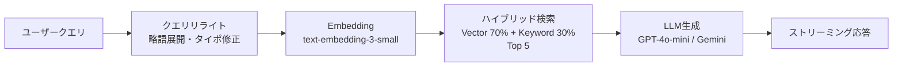
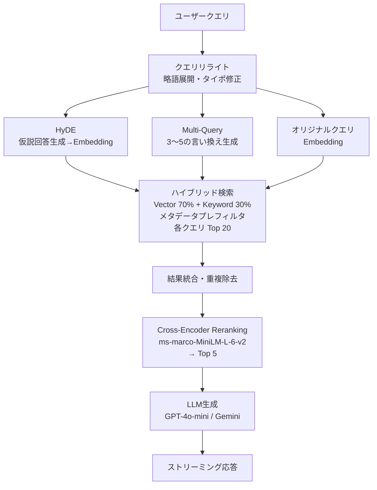
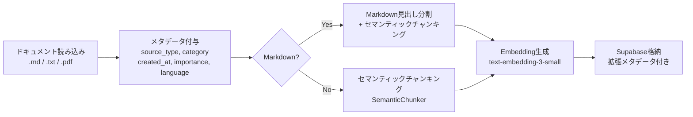

# RAG Lv.4 刷新 — 詳細実装計画

## 概要

現在の RAG パイプライン（Lv.3）を Lv.4 に刷新する。5つの施策を依存関係を考慮した順序で実装する。

## 現在のパイプライン

## 刷新後のパイプライン

## 事前準備パイプライン（チャンキング刷新）

---

## Phase 1: RAGAS 評価基盤（全改善の前提）

### 目的
改善前のベースラインスコアを記録し、各施策の効果を定量計測可能にする。

### 実装タスク

- [x] 1-1. `lib/evaluator.py` に RAGAS 4指標の計測関数を追加
  - Context Recall: 検索結果に正解情報が含まれているか
  - Context Precision: 検索結果の上位に正解情報があるか
  - Faithfulness: 回答がコンテキストに忠実か
  - Answer Relevancy: 回答が質問に関連しているか
- [x] 1-2. テストデータセット（Q&A + Ground Truth）の構築
  - 最低10問のテストケース
  - 各質問に正解回答と正解コンテキストを付与
- [ ] 1-3. ベースラインスコアの計測・記録
  - 現在のパイプラインで4指標を計測
  - 結果を `aidlc-docs/ragas_baseline.md` に記録
- [x] 1-4. 改善前後の比較レポート自動生成機能
- [x] 1-5. テスト作成（`tests/test_evaluator.py` 拡張）

### 変更対象ファイル
| ファイル | 変更内容 |
|---------|---------|
| `lib/evaluator.py` | RAGAS 4指標の計測関数追加 |
| `tests/test_evaluator.py` | テスト追加 |

### 決定済み事項
- RAGAS ライブラリ（`ragas>=0.4.3`）を使用（pyproject.toml に既存）
- 4指標すべてを計測

### 未決事項
- テストデータセットの内容（OQ-003 参照）

### 今回決めない事項
- RAGAS スコアの合格基準値（ベースライン計測後に設定）

---

## Phase 2: Cross-Encoder Reranking

### 目的
初回検索で広く取得（20件）→ Cross-Encoder で精密に再スコアリング → 上位5件に絞ることで Precision を向上。

### 実装タスク

- [x] 2-1. `requirements.txt` / `pyproject.toml` に `sentence-transformers` を追加
- [x] 2-2. `lib/rag_chain.py` に `rerank_documents()` 関数を追加
  - Cross-Encoder モデル: `cross-encoder/ms-marco-MiniLM-L-6-v2`
  - 入力: クエリ + 検索結果10件
  - 出力: 再スコアリング後の上位5件
  - `@lru_cache` でモデルインスタンスをキャッシュ
- [x] 2-3. `search_relevant_documents()` の `match_count` デフォルトを 5 → 10 に変更
- [x] 2-4. `lib/graph.py` に `rerank` ノードを追加
  - パイプライン: `rewrite_query → [hyde, multi_query, retrieve](並列) → merge → rerank(Top 5) → generate`
- [ ] 2-5. RAGAS で改善効果を計測
- [ ] 2-6. テスト作成（`tests/test_rag_chain.py` 拡張）

### 変更対象ファイル
| ファイル | 変更内容 |
|---------|---------|
| `lib/rag_chain.py` | `rerank_documents()` 追加、`match_count` 変更 |
| `lib/graph.py` | `rerank` ノード追加、パイプライン再構成 |
| `requirements.txt` | `sentence-transformers` 追加 |
| `pyproject.toml` | `sentence-transformers` 追加 |
| `tests/test_rag_chain.py` | Reranking テスト追加 |
| `tests/test_graph.py` | パイプラインテスト更新 |

### 決定済み事項
- ローカル Cross-Encoder（`cross-encoder/ms-marco-MiniLM-L-6-v2`）を使用
- 初回取得20件 → Rerank後5件

### 未決事項
- CPU環境でのレイテンシ許容範囲（OQ-001 参照）

### 今回決めない事項
- Cohere Rerank API への切り替え判断（レイテンシ計測後）

---

## Phase 3: セマンティックチャンキング

### 目的
固定長分割の代わりに、文間の意味的類似度に基づいて分割し、チャンクの内容一貫性を向上。

### 実装タスク

- [x] 3-1. `requirements.txt` / `pyproject.toml` に `langchain-experimental` を追加
- [x] 3-2. `lib/embedding_pipeline.py` に `semantic_chunk_documents()` 関数を追加
  - `SemanticChunker` を使用
  - `breakpoint_threshold_type="percentile"` で初期設定
  - Markdown の場合: 見出し分割後にセマンティックチャンキング
  - 非Markdown の場合: 直接セマンティックチャンキング
- [x] 3-3. `chunk_documents()` に `use_semantic=True/False` パラメータを追加（切り替え可能）
- [x] 3-4. メタデータに `chunking_method` を追加（`"semantic"` or `"fixed"`）
- [ ] 3-5. RAGAS で改善効果を計測
- [ ] 3-6. テスト作成（`tests/test_embedding_pipeline.py` 拡張）

### 変更対象ファイル
| ファイル | 変更内容 |
|---------|---------|
| `lib/embedding_pipeline.py` | `semantic_chunk_documents()` 追加、`chunk_documents()` 拡張 |
| `requirements.txt` | `langchain-experimental` 追加 |
| `pyproject.toml` | `langchain-experimental` 追加 |
| `tests/test_embedding_pipeline.py` | セマンティックチャンキングテスト追加 |

### 決定済み事項
- `langchain_experimental.text_splitters.SemanticChunker` を使用

### 未決事項
- 類似度閾値の初期値（OQ-002 参照）

### 今回決めない事項
- 自前実装への切り替え（SemanticChunker で問題が出た場合）

---

## Phase 4: クエリ変換の高度化（HyDE + Multi-Query）

### 目的
HyDE（仮説回答のEmbeddingで検索）と Multi-Query（言い換え並列検索）を並列実行し、Recall を最大化。

### 実装タスク

- [x] 4-1. `lib/graph.py` に `hyde_query()` ノードを追加
- [x] 4-2. `lib/graph.py` に `multi_query_expand()` ノードを追加
- [x] 4-3. `lib/graph.py` に `merge_results()` ノードを追加
- [x] 4-4. `RAGState` に新しいフィールドを追加
- [x] 4-5. LangGraph パイプラインを再構成
- [ ] 4-6. RAGAS で改善効果を計測
- [ ] 4-7. テスト作成（`tests/test_graph.py` 拡張）

### 変更対象ファイル
| ファイル | 変更内容 |
|---------|---------|
| `lib/graph.py` | `hyde_query()`, `multi_query_expand()`, `merge_results()` ノード追加、パイプライン再構成 |
| `lib/rag_chain.py` | 複数クエリでの検索対応 |
| `tests/test_graph.py` | パイプラインテスト更新 |

### 決定済み事項
- HyDE + Multi-Query を並列実行し、結果を統合後 Rerank で絞る
- Multi-Query は3〜5の言い換え

### 未決事項
- なし

### 今回決めない事項
- 質問の複雑度に応じた動的切り替え（保留論点）

---

## Phase 5: メタデータフィルタリング

### 目的
検索前にメタデータでプレフィルタし、不要なチャンクを検索対象から除外して精度向上。

### 実装タスク

- [x] 5-1. `lib/embedding_pipeline.py` のメタデータ付与を拡張
- [x] 5-2. `supabase-setup.sql` に メタデータフィルタ対応の RPC 関数を追加
- [x] 5-3. `lib/rag_chain.py` の `search_relevant_documents()` にフィルタパラメータを追加
- [x] 5-4. メタデータ用の GIN インデックスを追加
- [ ] 5-5. RAGAS で改善効果を計測
- [ ] 5-6. テスト作成

### 変更対象ファイル
| ファイル | 変更内容 |
|---------|---------|
| `lib/embedding_pipeline.py` | メタデータ付与ロジック拡張 |
| `lib/rag_chain.py` | `metadata_filter` パラメータ追加 |
| `supabase-setup.sql` | `match_documents_hybrid_filtered()` 追加、GINインデックス追加 |
| `tests/test_rag_chain.py` | メタデータフィルタテスト追加 |
| `tests/test_embedding_pipeline.py` | メタデータ付与テスト追加 |

### 決定済み事項
- メタデータ項目: `source_type`, `created_at`, `category`, `importance`, `language`

### 未決事項
- なし

### 今回決めない事項
- `tenant_id` の追加（マルチテナント対応時）
- UIからのメタデータフィルタ指定（将来のダッシュボード機能）

---

## 依存パッケージ追加一覧

| パッケージ | Phase | 用途 |
|-----------|-------|------|
| `sentence-transformers` | Phase 2 | Cross-Encoder Reranking |
| `langchain-experimental` | Phase 3 | SemanticChunker |

※ `ragas>=0.4.3` と `datasets>=4.8.4` は pyproject.toml に既存

---

## 実装スケジュール（目安）

| Phase | 施策 | 期間 | 前提 |
|-------|------|------|------|
| 1 | RAGAS 評価基盤 | 1〜2週間 | なし（最初に着手） |
| 2 | Cross-Encoder Reranking | 1週間 | Phase 1 完了（効果計測のため） |
| 3 | セマンティックチャンキング | 1〜2週間 | Phase 1 完了（効果計測のため） |
| 4 | HyDE + Multi-Query | 1〜2週間 | Phase 2 完了（Rerank との統合） |
| 5 | メタデータフィルタリング | 1週間 | Phase 2 完了（検索関数の拡張） |

合計: 5〜8週間

---

## 成功指標

- [ ] RAGAS 4指標のベースラインスコアを記録
- [ ] Reranking 導入後、Context Precision が改善
- [ ] セマンティックチャンキング導入後、チャンク品質が改善
- [ ] HyDE + Multi-Query 導入後、Recall が改善
- [ ] 全施策完了後、4指標すべてで改善を確認
- [ ] `ARCHITECTURE.md` を刷新後のパイプラインに更新

---

## レビュー承認

本計画のレビューと承認をお願いします。承認後、Phase 1（RAGAS 評価基盤）の実装に着手します。
